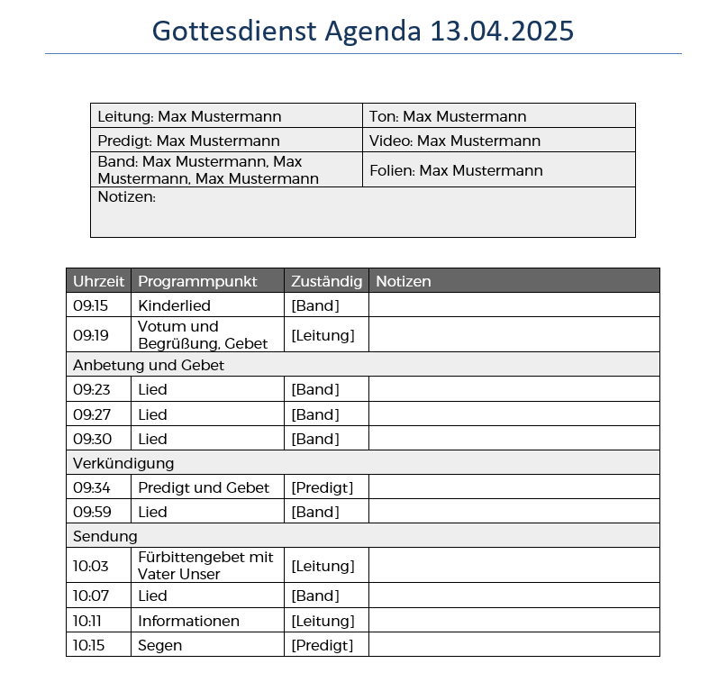

# ChurchTools-Agenda-Export

# Installation
Im "backend" Ordner ```pip install -r ./requirements.txt``` ausführen.

Im "frontend" Ordner ```npm install``` ausführen.

# Ausführen
Im "backend" Ordner ```flask run --port=5001 --debug``` ausführen.

Im "frontend" Ordner ```npm run dev``` ausführen.

# Beispielagenda

